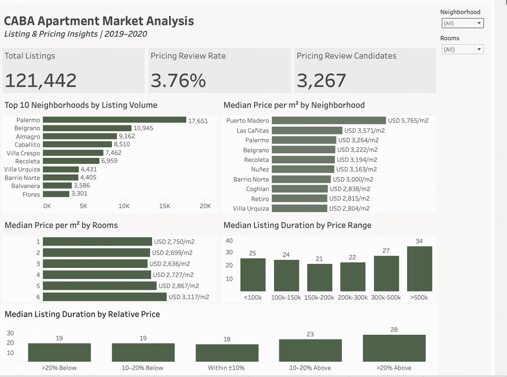

# CABA Apartment Market Analysis

A data analysis project exploring apartment listings in Buenos Aires (CABA) to identify market patterns, attractive acquisition segments, and listings that may require pricing review.



## Business Problem

A real estate agency operating in Buenos Aires wants to better understand the apartment market in order to:

- Identify neighborhoods and apartment segments with high listing activity.
- Understand how asking price per square meter varies across neighborhoods and apartment sizes.
- Explore how listing duration varies across market segments.
- Evaluate whether listings priced above comparable properties tend to remain active longer.
- Identify listings that may require additional pricing review.

The analysis focuses on apartment listings for sale in CABA priced in USD.

## Dataset

The project uses historical property listing data from the Properati dataset **Property Listings for 5 South American Countries**.

The original Argentina file contains approximately 1 million listing records. After filtering the data to apartment listings for sale in CABA and priced in USD, the analytical universe contains **121,442 listings**.

The data covers approximately **March 2019 to March 2020**.

Raw datasets are not included in this repository due to file size. See [`data/README.md`](data/README.md) for additional information.

## Tools

- **Python**
- **Pandas**
- **Jupyter Notebook**
- **Tableau**
- **Git / GitHub**

Python and Pandas were used for data understanding, cleaning, feature engineering, exploratory analysis, and preparation of the final analytical dataset. Tableau was used to build the interactive dashboard.

## Analysis Workflow

The project was structured into four stages:

**1. Data Understanding**  
Exploration of dataset structure, variables, geographic hierarchy, currencies, property types, missing values, and data quality issues.

**2. Data Cleaning**  
Filtering the analytical population, validating prices and surface areas, handling missing and anomalous values, and calculating asking price per square meter.

**3. Exploratory Data Analysis**  
Analysis of listing concentration, price per m2, apartment size, listing duration, relative pricing, and market segments.

**4. Dashboard Preparation**  
Creation of analytical features and pricing-review indicators used in the Tableau dashboard.

The complete analysis can be found in the [`notebooks/`](notebooks/) directory.

## Key Findings

- **Palermo has the largest listing volume**, representing approximately 15% of listings with a known neighborhood.

- Asking price per m2 varies substantially across neighborhoods, with **Puerto Madero showing the highest median asking price per m2** among neighborhoods with sufficient observations.

- Smaller apartments generally command higher asking prices per m2 within several high-volume neighborhoods.

- Listing duration does not follow a simple relationship with total asking price. Listings in the **USD 150k - 300k range showed relatively shorter median observed listing durations**, while listings above USD 500k remained active longer.

- Relative pricing showed a clearer pattern. Listings priced **more than 20% above the median of comparable listings** had a median observed listing duration of approximately **28 days**, compared with **18 days** for listings priced within +- 10% of their comparable segment.

- Approximately **3.76% of pricing-eligible listings** were flagged as candidates for additional pricing review.

## Pricing Review Methodology

Comparable properties were defined using:

**Neighborhood + number of rooms**

For each comparable segment, the median asking price per m2 was calculated.

Listings were evaluated relative to this segment median. To reduce unreliable comparisons, the pricing-review methodology was only applied to segments containing at least **100 listings**.

Listings with unusually high price per m2 relative to their comparable segment were flagged as **pricing review candidates**.

The flag is intended as a screening tool and does not imply that a property is incorrectly priced.

## Dashboard

The Tableau dashboard allows users to explore the CABA apartment market by **neighborhood** and **number of rooms (ambientes)**.

It includes:

- Total listing volume
- Pricing review rate
- Pricing review candidates
- Neighborhood listing concentration
- Median asking price per m2
- Median observed listing duration by price range
- Median observed listing duration by relative pricing

The packaged Tableau workbook is available in the [`dashboard/`](dashboard/) directory.

## Business Recommendations

The analysis suggests that acquisition efforts can prioritize high-volume segments with relatively short observed listing durations, particularly selected **2–3 room segments in Palermo** and **2-room segments in Almagro and Villa Crespo**.

For pricing decisions, listings should be compared with properties in the same neighborhood and room category rather than relying only on city-wide averages.

Listings priced substantially above their comparable segment can be prioritized for additional pricing review.

## Limitations

- The dataset contains **listing data, not confirmed property transactions**.
- Prices represent **asking prices**, not final sale prices.
- Listing duration represents observed time between listing start and end dates and should **not be interpreted as confirmed time-to-sale**.
- Approximately one quarter of the filtered listings do not contain a usable end date.
- Historical data covers approximately 2019 - 2020 and should not be interpreted as representing the current Buenos Aires real estate market.
- Unique listing IDs do not necessarily guarantee that every row represents a unique physical property.

## Project Structure

```text
caba-real-estate-market-analysis/
caba-real-estate-market-analysis/
|-- README.md
|-- data/
|   `-- README.md
|-- notebooks/
|   |-- 01_data_understanding.ipynb
|   |-- 02_data_cleaning.ipynb
|   |-- 03_eda.ipynb
|   `-- 04_prepare_dashboard.ipynb
`-- dashboard/
    |-- caba_apartment_market_analysis.twbx
    `-- caba_apartment_market_dashboard.png
```